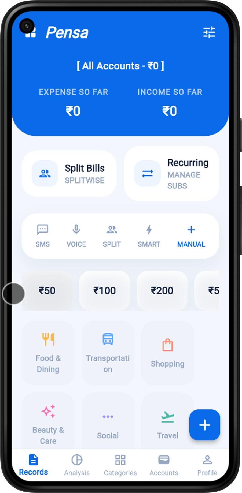

# XPens 💸

XPens is a modern, personal expense tracker designed for a simple, focused, and intuitive money-management experience. It makes daily spending easy to log, review, and understand—all without clutter, complex setups, or privacy compromises.

  

---

## ✨ Why Choose XPens?

| Advantage | Description |
| :---: | --- |
| 🛡️ **Absolute Privacy** | We don't have servers, we don't sell data, and there are no ads. All data is kept strictly on your local device. |
| ⚡ **Lightning Fast** | Built with Flutter for native performance. Add an expense in seconds without waiting for cloud syncs. |
| 🪟 **Clear Interface** | View your spending and accounts in a clean, distraction-free layout. |
| 📴 **Offline Ready** | No internet required. Manage your money anytime, anywhere. |

---

## 🚀 Core Features

| Feature | What it does |
| --- | --- |
| 📝 **Smart Expense Logging** | Instantly capture the amount, category, date, and notes for every purchase. |
| 🏦 **Multi-Account Support** | Manage multiple accounts, banks, and cash wallets in one place to consolidate your finances. |
| 📉 **Budget Planning** | Set monthly budgets for different categories and track your progress to prevent overspending. |
| 📊 **Visual Analytics** | Beautiful charts and graphs show spending patterns. Understand where your money goes. |
| 🏷️ **Categories** | Organize your spending by categories to see exactly where your money goes. |
| 🔁 **Recurring Subscriptions**| Manage your monthly or annual recurring bills so you never miss a payment. |
| 🙈 **Privacy Mode** | Hide sensitive balances and amounts with a quick toggle for public spaces. |

---

## 🎯 Roadmap (Coming Soon)

We are actively building new, frictionless ways to manage your money:

*   **Voice Input:** Log expenses hands-free.
*   **SMS Parsing:** Auto-log from bank text messages.
*   **Split Bills:** Divide tabs with friends easily.
*   **Web Version:** Manage from your desktop browser.
*   **Google Play / App Store Availability:** Expanded distribution options.

---

## 📱 Supported Platforms

Enjoy tracking your expenses on any device! XPens currently supports:

✅ Android (via GitHub Releases)
🔜 iOS (Planned)
🔜 Web Version (Planned)

---

## 📄 License

This project is licensed under the MIT License. See [LICENSE](LICENSE) for details.
